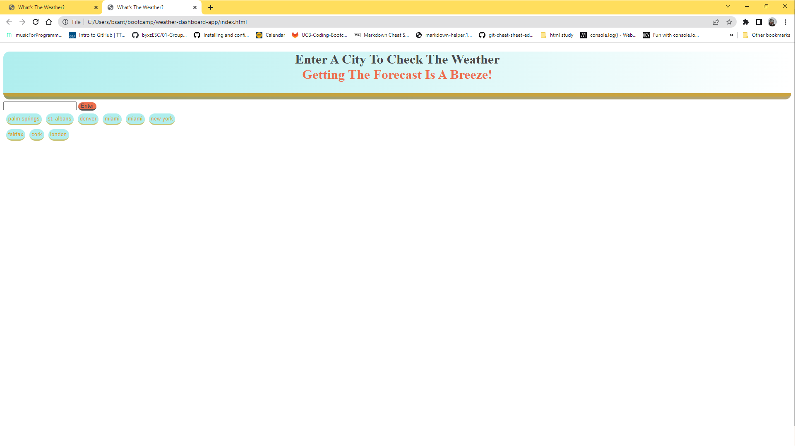
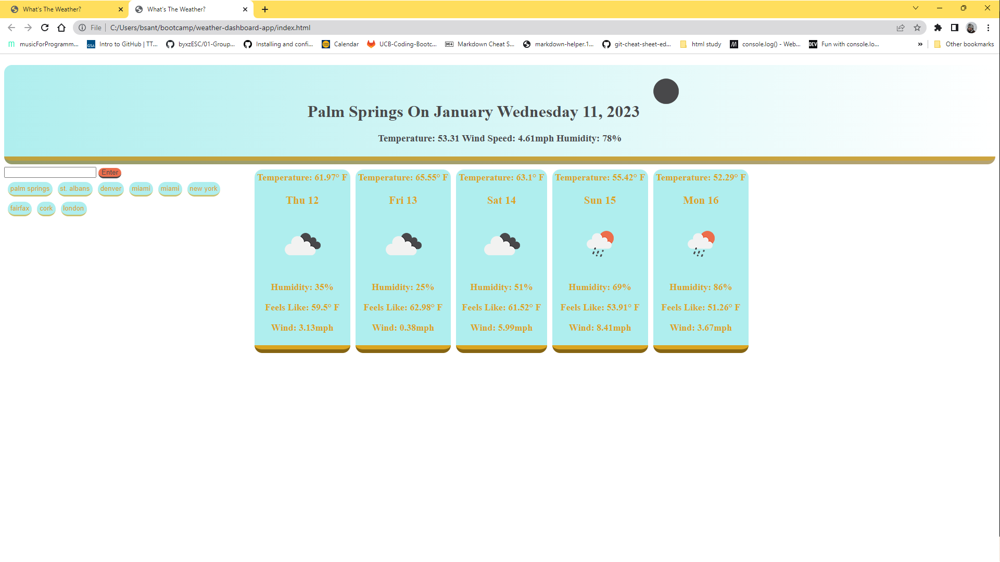

# Weather Dashboard

## technologies Used

| Technology Used         | Resource URL           | 
| ------------- |:-------------:| 
| Javascript    | [https://developer.mozilla.org/en-US/docs/Web/JavaScript](https://developer.mozilla.org/en-US/docs/Web/JavaScript) | 
| HTML    | [https://developer.mozilla.org/en-US/docs/Web/HTML](https://developer.mozilla.org/en-US/docs/Web/HTML) |   
| Git | [https://www.w3schools.com/git/default.asp](https://www.w3schools.com/git/default.asp)     |  
| Day.js | [https://day.js.org/](https://day.js.org/)     |  
| OpenWeatherMap | [https://openweathermap.org/api](https://openweathermap.org/api)     |  

## Description

[Visit the deployed site here](https://brettsantor.github.io/weather-dashboard-app/)

Get the current weather and five day forecast at just the click of a button. This application uses Open Weather Map API to bring you up to date weather information such as the temperature, humidity and more! 

## Usage

Check the weather by entering the name of any city. Your city will be saved as a button on the page for next time. The current weather conditions will post to the header of the page and the 5 day forecast will post by day as cards.

## Learning Points

During this project I gained experience calling on a server side API and dynamically displaying the parsed information to the page. The building of this app also called to dig into technical documentation to understand how to utilize the API.

## Arthor Info

[Github](https://github.com/BrettSantor)

[LinkdIn](https://www.linkedin.com/in/brett-santor-a098b923b/)

[Portfolio](https://brettsantor.github.io/Santor-Services/)

You can find out more about me and my work by following these links!

## Credit

All this coding made possible by [Jerome Chenette](https://github.com/jeromechenette) and my fellow students who help each other along the way
